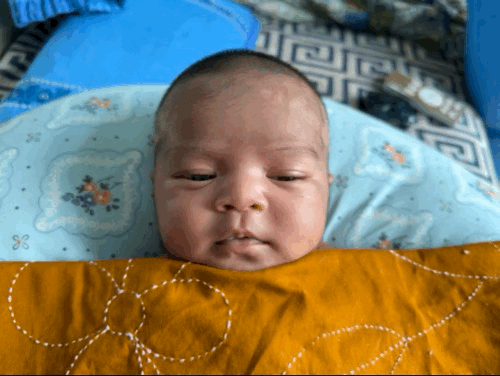

# Tiash's website!

Hello, I'm Ridwan Bin Mohammad. Please don't call me Ridwan, instead call me Tiash. I'm a young (<my-age></my-age> years old) developer. This is my little spot in the web.

I also have [a sister  (Raiyan Binte Mohammad Tista)](tista.gif). None of this would be possible without [my mother](https://www.linkedin.com/in/kftrisha/).

I have many [projects](https://www.linkedin.com/in/rbm-tiash/details/projects/), such as an [image format](https://tiash.is-cool.dev/nvgif/) and an [operating system](https://github.com/PopcornOS/popcorn-os). I've also [written some stuff](writing/).

   

> Check out [my new project](/py0.9.1-win32/) on porting Python 0.9.1 to Windows and publishing the docs online.

<fb-acc-countdown></fb-acc-countdown>

## Why did I get redirected here?

If you got redirected from https://tiashfam.w3spaces.com/, then it's because that was my old website. It has been shut down because: 

1. It's too hard to write raw HTML, CSS and JavaScript. This new site is written in Markdown with the static site generator Jekyll.
2. Without W3Schools Pro, W3Schools Spaces has a limit on how many visits your site gets.
3. It also has a limit on how many files your site can have.

All important stuff has been moved (for example, my [blog](blog/), previously News, and my [writings](writing/), previously Books).

If you got redirected from https://tiash-and-cats.github.io/, that's because that was the old domain for this website. This site has been moved to the new domain https://tiash.is-cool.dev/, which you should be able to see in your address bar.