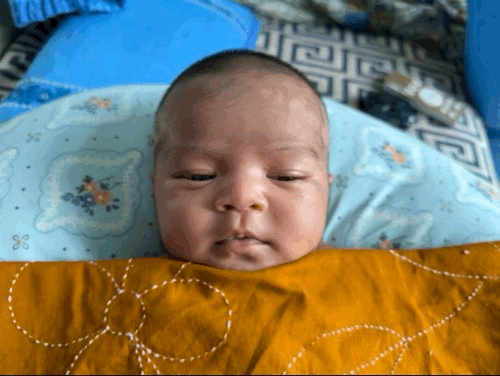

# Tiash's website!

> STUDENTS OF SUMMERFIELD WHO WERE IN CLASS 5 BEFORE 2026! [Remember Bembem miss?](#students-of-summerfield)

Hello, I'm Ridwan Bin Mohammad. Please don't call me Ridwan, instead call me Tiash. I'm a young (<my-age></my-age> years old) developer. This is my little spot in the web.

I also have [a sister  (Raiyan Binte Mohammad Tista)](tista.gif). None of this would be possible without [ my mother](https://www.linkedin.com/in/kftrisha/).

<picture>
  <source 
    srcset="https://github-stats-extended.vercel.app/api?username=tiash-and-cats&include_all_commits=true&theme=highcontrast" 
    media="(forced-colors: active)">
  
</picture>

<picture>
  <source 
    srcset="https://github-stats-extended.vercel.app/api/top-langs?username=tiash-and-cats&langs_count=4&theme=highcontrast&layout=compact" 
    media="(forced-colors: active)">
  
</picture>

I have many [projects](https://www.linkedin.com/in/rbm-tiash/details/projects/), such as an [image format](https://tiash.is-cool.dev/nvgif/) and an [operating system](https://github.com/PopcornOS/popcorn-os). I've also [written some stuff](writing/).

<a href="https://github.com/tiash-and-cats/nvgif">
<picture>
  <source 
    srcset="https://github-stats-extended.vercel.app/api/pin?username=tiash-and-cats&repo=tiash-and-cats%2Fnvgif&theme=highcontrast" 
    media="(forced-colors: active)">
  
</picture>
</a>
<a href="https://github.com/PopcornOS/popcorn-os">
<picture>
  <source 
    srcset="https://github-stats-extended.vercel.app/api/pin?username=tiash-and-cats&repo=PopcornOS%2Fpopcorn-os&theme=highcontrast" 
    media="(forced-colors: active)">
  
</picture>
</a>
<a href="https://github.com/tiash-and-cats/finder">
<picture>
  <source 
    srcset="https://github-stats-extended.vercel.app/api/pin?username=tiash-and-cats&repo=tiash-and-cats%2Ffinder&theme=highcontrast" 
    media="(forced-colors: active)">
  
</picture>
</a>
<a href="https://github.com/tiash-and-cats/py0.9.1">
<picture>
  <source 
    srcset="https://github-stats-extended.vercel.app/api/pin?username=tiash-and-cats&repo=tiash-and-cats%2Fpy0.9.1-win32&theme=highcontrast" 
    media="(forced-colors: active)">
  
</picture>
</a>

<t-unescaped data-html="<iframe src='https://turbowarp.org/1326533734/embed?addons=vol-slider&fullscreen-background=white' scrolling='no' allowfullscreen></iframe>"></t-unescaped>
<t-unescaped data-html="<iframe src='https://turbowarp.org/1332738049/embed?addons=vol-slider&fullscreen-background=white' scrolling='no' allowfullscreen></iframe>"></t-unescaped>

> Check out [my new project](/py0.9.1-win32/) on porting Python 0.9.1 to Windows and publishing the docs online.

<fb-acc-countdown></fb-acc-countdown>

## STUDENTS OF SUMMERFIELD!

Did you know a teacher named Bembem Miss? You probably do if you were in class 5 before 2026.

Our beloved Bembem Miss is sadly in the ICU for a rare neurological disorder (Miller Fisher Syndrome (GBS)). Any help is wholly appreciated. This is coming from the keyboard of one of her old students. As I can't easily donate, I'm doing my part by sharing awareness.

- [GoFundMe](https://gofund.me/5b0045e76)
- Screenshots of the Facebook post (I couldn't get the link due to the above Facebook problem)
  - [here](bembem-post-1.jpg)
  - [here](bembem-post-2.jpg)
- Text of the Facebook post
  > 💔 A Young Dream Shattered in a Moment — Please Help Us Give Her Hope Again 🙏
  > 
  > \*\*\*Go fund me link to donate https://gofund.me/d6117df44
  > 
  > Donation details from Bangladesh: 
  > 
  > Bank: Eastern Bank Limited
  > Account no: 0081250063889
  > Account name: ANUP DEWAN & RAKESH DEWAN
  > Branch name: Panchlaish
  > 
  > bKash: 01819883494
  > Name: Anup Dewan
  > 
  > \*\*\*\*\*\*\*\*\*\*\*
  > 
  > Bembem is a bright and determined young student who left her family in Bangladesh and came to Australia with a dream — to build a better future and become an Early Childhood Teacher, a profession she was passionate about as she wanted to make a difference in little children’s lives. 
  > But she was suddenly struck by Guillain-Barré Syndrome (GBS), a rare and serious autoimmune neurological condition. Her condition deteriorated rapidly, and she was admitted to the ICU, where she became paralysed and lost the ability to move and experience her senses normally.
  > A young woman who came to Australia full of dreams is now fighting a battle no one could have imagined.
  > Her family is facing enormous emotional and financial pressure as they stand beside her through this devastating journey. Her, rehabilitation and ongoing support will require significant financial resources. She will not be able to earn her living for uncertain period of time until she fully regains her ability to even walk. 
  > 🙏 We are reaching out to all of you for help.
  > Every donation, no matter how small, can make a meaningful difference — helping with her, rehabilitation, accommodation, travel and the many costs her family is now facing.
  > 
  > If you are unable to donate, please share this post. Your share could reach someone who can help.
  > 
  > Let’s come together and give this young student the support she needs to keep fighting, recover and one day return to the life she dreamed of.
  > 
  > ❤️ Please donate. Please share. Please keep her in your thoughts and prayers.
  > Every contribution is a step towards hope. 🙏❤️
  > \#HelpHerRecover \#GuillainBarreSyndrome \#Fundraising \#SupportHerJourney \#EarlyChildhoodTeacher \#CommunitySupport \#Hope \#PleaseDonate
  > 
  > https://gofund.me/d6117df44

With the help of the community, she will, inshallah, be better.

## Why did I get redirected here?

If you got redirected from https://tiashfam.w3spaces.com/, then it's because that was my old website. It has been shut down because: 

1. It's too hard to write raw HTML, CSS and JavaScript. This new site is written in Markdown with the static site generator Jekyll.
2. Without W3Schools Pro, W3Schools Spaces has a limit on how many visits your site gets.
3. It also has a limit on how many files your site can have.

All important stuff has been moved (for example, my [blog](blog/), previously News, and my [writings](writing/), previously Books).

If you got redirected from https://tiash-and-cats.github.io/, that's because that was the old domain for this website. This site has been moved to the new domain https://tiash.is-cool.dev/, which you should be able to see in your address bar.