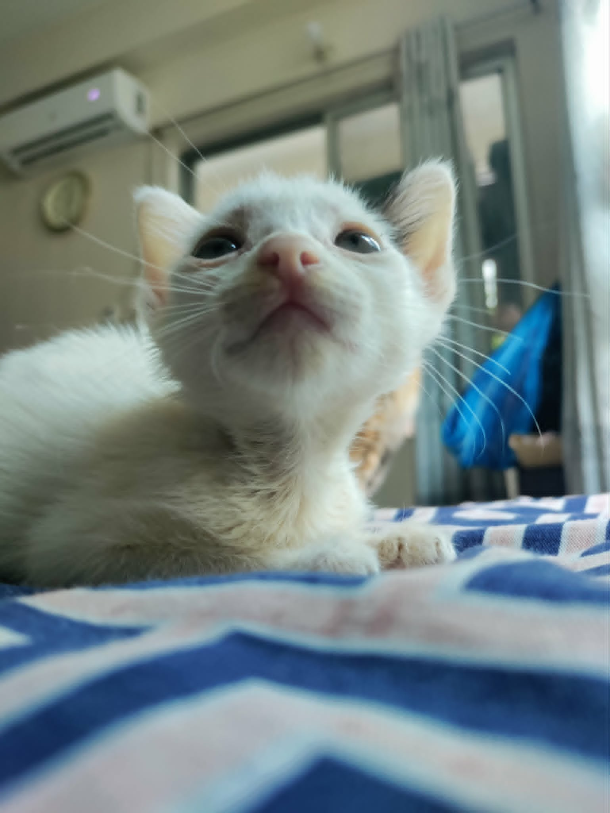

# Bingsu's days



> *In memory of Bingsu (Apr-Oct 2025), our most playful kitten. I think of you every night.*

Bingsu (Apr-Oct 2025) was a kitten. She had white fur with some black splotches. She had a black spot on her behind and a spot both on her ear and beside it, so that when looked at from behind, formed a heart. She had a hard life, but she was always playful, only slowing down in her final days.

## Early life

My mother found her in the garage when she was two months old. Bingsu was so bloody and injured that, at first, my mother thought she was an old, dirty, tattered cloth. She was disgusted, and asked the guard at the gate why there was such a dirty cloth. She was surprised, therefore, when the guard said, "This is a kitten! I found her on the edge of the road."

She was quickly taken indoors and cleaned up.

A few weeks later, she was diagnosed with FIP. For a few long weeks, she was given medication through a cannula. But she got better.

## Happy days

She was the most playful, lively, happy, but spicy kitten ever. She had skin infections from time to time, but she still pushed forward. My female cats (I have 2) didn't like her that much, but my male cat did.

She stayed this way until a few weeks before her death.

<video controls width="400" title="Bingsu, at 6 months old, just before her final chapter. She's lively and playful, biting my mother's finger as she plays with her.">
  <source src="bingsu-6-months.mp4" type="video/mp4">
  <em>[Video] Bingsu, at 6 months old</em>
</video>

## Last chapter

A few weeks before her death, she started having seizures. She had apparently gained some serious brain problems, which meant she could neither see nor hear nor smell nor taste properly. This was proven when she mistook her, uh... bodily waste for food.

2 days before her passing, she had a seizure, and in spasming, she ripped out all the nails of one of her paws.

On her final day, she had six seizures in the morning, back-to-back. She couldn't even breathe. She suffocated in my mother's arms on the way to the vet.

## Legacy

I miss her every day. Sometimes I'm sad that she died such a horrible death. I hope she's in heaven, chasing butterflies in the clouds.